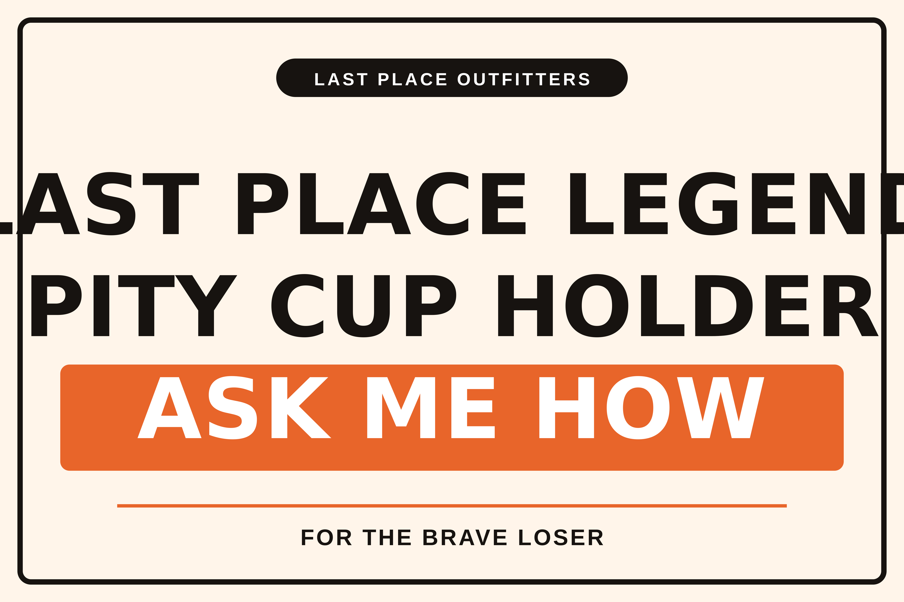

# Approval: LAST PLACE LEGEND PITY CUP HOLDER ASK ME HOW

**Why it may sell:** Scoreboard style and a high-contrast orange palette make the three short lines instantly readable from a distance. Phrases are goofy but specific — ironic ‘legend’ plus ‘pity cup’ and the cheeky ‘ask me how’ invite teasing and storytelling. The flag is designed as a clear, single-purpose humiliation prop that works indoors or outdoors; double-sided print ensures the message shows no matter how it

**Price:** $24.99

**Title:** Funny Last-Place Flag for Fantasy Football Punishment

**Tags:** last place flag, loser punishment, fantasy football gag, humiliation gift, funny penalty flag, last place gift, draft day shame, pity cup banner, loser celebration, adult gag gift, backyard shame flag, double sided flag, printed to order

Merge this pull request to publish. Close it to reject.
